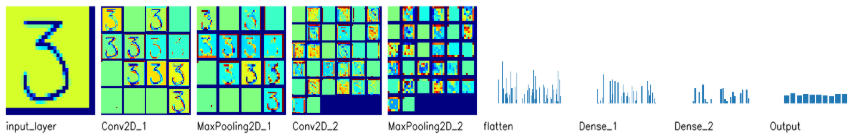

# ECE5831 - Final Project

This repository contains an interactive visualization tool for Convolutional Neural Networks built as a project for one of our courses, ECE5831 PAttern Recognition and Neural Networks. The tool is designed for educators, students, and researchers. This project provides real-time, layer-by-layer visualization of CNN operations, helping to intuitively learn about complex concepts.

The **Interactive CNN Visualization Tool** allows users to:
- Draw/Upload Images: provide customized images for processing by the CNN.
- Visualize in Real Time: Observe feature maps and activation patterns through convolutional, pooling, and dense layers.
- Understand CNN Operations: Gain insights into edge detection, feature extraction, and classification processes.

The project uses Streamlit for the interactive interface, TensorFlow for the CNN architecture, and OpenCV for image preprocessing.

**NOTE:** 
- The provided Jupyter notebook, final-project.ipynb, demonstrates CNN operations using OpenCV (cv2) only, as Streamlit is not supported within Jupyter environments.
- To experience the full interactive user interface, please run the project using Streamlit (see instructions below).

### Getting Started
1. Install the dependencies:\
   `pip install -r requirements.txt`
2. Run the Application:\
   `streamlit run app.py`
3. Input an Image:\
   You can either draw an image using the interactive canvas or upload a custom image. 

Explore visualizations of the CNN layers!

Here is an example:

### Resources
* Dataset - We haven't used any specific dataset since our projects focuses on visualization rather than on traning a CNN for one specific dataset.
* Project Report [Link to Report](https://drive.google.com/file/d/1ZSVbu-SzPwG6AAwbmZQVQC5BbeE5uFE7/view?usp=drive_link)
* Presentation Slides [Link to Slides](https://drive.google.com/file/d/15AHJgBnLUnZc3_UFvz5YuQexnoxSzG9g/view?usp=drive_link)
* Presentation [Link to Video](https://youtu.be/zHOBiQmFux4)
* Demo [Link to Video](https://drive.google.com/file/d/190AmJZ7Ujdnk0YnIvN8IXVZmh7lTCw5q/view?usp=drive_link)
